# Business Intelligence Agent for Snowflake

A conversational AI assistant that helps business owners and managers access and analyze their company data through natural language questions.

## System Capabilities

### Architecture Overview


### Data Flow Pipeline

```mermaid
flowchart LR
    subgraph SN["❄️ Snowflake"]
        SND["Customer Data"]
        SNR["Revenue Metrics"]
    end
    
    subgraph GS["📊 Google Sheets"]
        GSR["Analysis Reports"]
        GSL["Contact Lists"]
    end
    
    subgraph EM["📧 Email"]
        EMC["Campaigns"]
        EMT["Notifications"]
    end
    
    SN -->|"replicate_data_to_sheet"| GS
    GS -->|"send_campaign_emails"| EM
    
    style SN fill:#29B5E8,stroke:#333,color:#fff
    style GS fill:#0F9D58,stroke:#333,color:#fff
    style EM fill:#EA4335,stroke:#333,color:#fff
```



## ✨ What Can You Ask?

This agent understands business questions and provides instant answers with data from your company's Snowflake data warehouse.

### Example Questions

**Sales & Revenue:**
- "Show me last quarter's sales"
- "What were our highest revenue months this year?"
- "How much revenue did we generate last month?"

**Customer & Account Information:**
- "Who are our top 10 customers by revenue?"
- "Show me account details for [Company Name]"
- "How many active accounts do we have?"

**Orders & Transactions:**
- "How many orders did we process last week?"
- "Show me recent transactions"
- "What's our average order value?"

**Data Export:**
- "Export last month's sales to Google Sheets"
- "Create a spreadsheet with our top customers"
- "Send this data to a new sheet"

## 🚀 How to Use

### Ask Questions in Plain English

Just type your question naturally - no need to know databases, SQL, or technical details:

```
You: "Show me our top 5 customers"
Agent: [Provides a clean table with customer names and revenue]

You: "Export this to Google Sheets"
Agent: [Creates a spreadsheet and shares the link]
```

### Get Data Exported to Google Sheets

The agent can automatically create Google Sheets with your data:
- Export query results
- Create formatted reports
- Share links instantly
- Save sheet aliases for easy reference

## 💡 Features

- **Natural Language**: Ask questions in plain English, no technical knowledge required
- **Instant Answers**: Get data formatted in clean, readable tables
- **Google Sheets Integration**: Export data directly to spreadsheets
- **Business-Focused**: Results presented in business terms (customers, sales, revenue, etc.)
- **Smart Context**: Agent understands business metrics and finds the right data
- **Error-Friendly**: Clear, helpful messages if something goes wrong

## 🎓 Learn About AI Agents
New to AI Agents? We have prepared comprehensive resources to help you understand the technology:

- **[📖 Comprehensive Agent Tutorial](TUTORIAL.md)**: Deep dive into Agent concepts, Architecture, RAG, Vector DBs, and the specific stack used in this project.
- **[Slides Generation Prompt](SLIDE_PROMPT.md)**: A ready-to-use prompt to generate a professional presentation deck from the tutorial content.

### 🛠️ For AI Engineers & Architects (Advanced)
- **[⚙️ Agent Engineering Handbook](AGENT_ENGINEERING_HANDBOOK.md)**: Deep dive into Vertex Reasoning Engine internals, A2A Protocols, Security Guardrails, and production CI/CD for agents.
- **[Technical Architecture Slides Prompt](TECHNICAL_SLIDE_PROMPT.md)**: Generate a CTO-level architecture deck emphasizing security, scalability, and stack choices.

## 📊 What You'll Get

### Clean Data Tables

Results are formatted as readable markdown tables:

| Customer | Revenue | Orders |
|----------|---------|--------|
| Acme Corp | $125,000 | 45 |
| Tech Solutions | $98,500 | 32 |
| Global Industries | $87,200 | 28 |

### Google Sheets Links

When you export data, you'll get:
- A shareable Google Sheets URL
- Formatted data with headers
- Easy-to-reference sheet aliases

## 🔧 For IT Teams: Setup

### 1. Install Dependencies
```bash
pip install -r requirements.txt
```

### 2. Environment Variables
Create a `.env` file:

```env
# Google AI
GOOGLE_API_KEY=your_gemini_api_key

# Snowflake Connection
SNOWFLAKE_USER=your_username
SNOWFLAKE_PASSWORD=your_password
SNOWFLAKE_ACCOUNT=your_account
SNOWFLAKE_WAREHOUSE=your_warehouse
SNOWFLAKE_DATABASE=your_database
SNOWFLAKE_SCHEMA=your_schema
SNOWFLAKE_ROLE=your_role

# Google Sheets (for exports)
GOOGLE_SERVICE_ACCOUNT_PATH=/path/to/service_account.json
```

### 3. Run or Deploy the Agent

To run the agent locally for testing:

1.  **Activate your virtual environment**:
    ```bash
    source venv/bin/activate
    ```
2.  **Start the local ADK web server**:
    ```bash
    adk web
    ```
    Open your browser to the URL provided (usually `http://127.0.0.1:8000`) to interact with your agent.

To deploy the agent to a production Google Cloud environment (requires `gcloud` CLI configured):

```bash
# Test locally
python verify_agent.py

# Deploy to production (see deploy.py)
python deploy.py
```


## 🛡️ Security & Privacy

- **Data Protection**: All connections use encrypted credentials
- **Access Control**: Agent only accesses data your Snowflake role permits
- **Audit Trail**: All queries and exports are logged
- **No Data Storage**: Agent doesn't store your business data

## 📈 Use Cases

### Executive Dashboards
- "Show me this quarter's key metrics"
- "Export monthly revenue trends to Google Sheets"

### Customer Analytics
- "Who are our most valuable customers?"
- "Show me customer growth over the past year"

### Sales Reports
- "What products are selling best?"
- "Create a sales report for last month"

### Financial Analysis
- "Show me profit margins by product category"
- "Export year-over-year financial comparison"

## ❓ FAQ

### Q: Do I need to know SQL?
**A:** No! Ask questions in plain English. The agent handles all technical details.

### Q: Can I see all available data sources?
**A:** Just ask questions about your business metrics. The agent will find and access the relevant data automatically.

### Q: How do I export data?
**A:** Just say "export this to Google Sheets" or "create a spreadsheet with [data]"

### Q: What if I get an error?
**A:** The agent provides friendly error messages. Try rephrasing your question or contact your IT support.

### Q: Can I save common reports?
**A:** Yes! Use sheet aliases to save frequently accessed reports (e.g., "monthly_sales").

## 🆘 Need Help?

If you encounter issues:
1. Try rephrasing your question
2. Be more specific about what data you need
3. Contact your IT support team

## 📧 Support

This agent is designed for business owners and managers. For technical support or configuration issues, please contact your IT department.

---

**Remember**: This is your business intelligence assistant. Ask it questions like you would ask a data analyst!

---
---

# QA Test Guide - Business Intelligence Agent

## Overview

This guide helps testers verify that the Business Intelligence Agent works correctly for business users. The agent should:
- Answer natural language questions (simple and complex)
- Handle multi-table queries and comparisons
- Provide business insights and context
- **Never expose** technical details (database names, table names, SQL queries)

---

## Part 1: Basic Functionality Tests

### 1. Natural Language Question Handling

**Objective**: Verify the agent understands and answers simple business questions correctly.

#### Test Case 1.1: Sales Queries
```
Question: "Show me last quarter's sales"
Expected: 
- Clean markdown table with sales data
- No mention of database/table names
- No SQL shown to user
- Data formatted with business-friendly column names
```

#### Test Case 1.2: Customer Information
```
Question: "Who are our top 10 customers by revenue?"
Expected:
- Table showing customer names and revenue
- Sorted by revenue (highest first)
- Business-friendly presentation
- No technical details exposed
```

#### Test Case 1.3: Account Lookup
```
Question: "Get account information for [Company Name]"
Expected:
- Account details presented in clean table
- Business metrics shown clearly
- Friendly error if account not found: "I couldn't find information for that account"
```

### 2. Data Export to Google Sheets

**Objective**: Verify Google Sheets integration works for business users.

#### Test Case 2.1: Basic Export
```
Question: "Export last month's sales to Google Sheets"
Expected:
- New Google Sheet created with descriptive name
- Data exported successfully
- Shareable link provided to user
- Success message in business language
```

#### Test Case 2.2: Smart Alias Handling
```
Steps:
1. Export data to a sheet
2. Agent asks: "Would you like to save this as 'Monthly Sales'?"
3. User says: "yes"

Expected:
- Agent immediately saves as 'Monthly Sales' (doesn't ask for name again!)
- Can retrieve saved sheets using aliases later
- User-friendly confirmation messages
```

#### Test Case 2.3: Custom Alias Name
```
Steps:
1. Export data to a sheet
2. Agent suggests: "Would you like to save this as 'Q4 Report'?"
3. User says: "call it Executive Dashboard instead"

Expected:
- Agent uses "Executive Dashboard" as the alias
- Natural conversation flow
```

### 3. Error Handling

**Objective**: Verify errors are presented in business-friendly language.

#### Test Case 3.1: Information Not Found
```
Question: "Show me sales for Product XYZ" (non-existent product)
Expected:
- NO technical errors like "Table not found" or "SQL error"
- Business-friendly message: "I couldn't find information about Product XYZ. Could you provide more details?"
- Suggestions for rephrasing if appropriate
```

#### Test Case 3.2: Ambiguous Requests
```
Question: "Show me data"
Expected:
- Agent makes reasonable assumption (e.g., shows sample recent data)
- OR asks for clarification in simple terms: "What data would you like to see? For example, sales, customers, or orders?"
```

### 4. Technical Detail Hiding

**Objective**: Ensure NO technical details are exposed to business users.

#### Test Case 4.1: No Database References
```
ANY question asked
Expected:
- NEVER mention database names (e.g., "FINANCIALS", "SNOWFLAKE_SAMPLE_DATA")
- NEVER mention schemas (e.g., "PUBLIC", "TPCH_SF1")  
- NEVER mention tables (e.g., "FINANCIAL_SUMMARY", "ORDERS")
```

#### Test Case 4.2: No SQL Exposure
```
ANY question asked, including complex multi-table queries
Expected:
- NEVER show SQL queries to users
- NEVER say things like "Let me run this SQL..." or "I'll query the database..."
- Use business language: "Let me find that for you" or "Here's what I found"
```

---

## Part 2: Advanced Functionality Tests

### 5. Multi-Table Analysis

**Objective**: Verify the agent can combine data from multiple tables without exposing technical details.

#### Test Case 5.1: Customer + Order Analysis
```
Question: "Who are our top customers by total order value?"
Expected:
- Agent internally JOINs customer and order tables
- Presents unified business view with customer names and totals
- Includes context: "Top 10 customers represent 62% of total revenue"
- NO mention of table names or JOIN operations
```

#### Test Case 5.2: Multi-Source Insights
```
Question: "Which products are most popular with our top customers?"
Expected:
- Agent combines customers + orders + products data
- Presents product rankings with insights
- Shows percentages and context
- Pure business language only
```

#### Test Case 5.3: Cross-Entity Relationships
```
Question: "Show customer lifetime value by segment"
Expected:
- Agent aggregates orders per customer
- Groups by segment
- Calculates totals
- Presents with business context
```

### 6. Comparative Analysis

**Objective**: Verify the agent can compare time periods and segments with proper calculations.

#### Test Case 6.1: Time Period Comparison
```
Question: "Compare this quarter's sales to last quarter"
Expected:
- Side-by-side comparison table:
  | Metric | Q4 2024 | Q3 2024 | Growth |
  |--------|---------|---------|--------|
  | Revenue | $1.2M | $1.0M | +20% |
  | Orders | 450 | 390 | +15.4% |
- Growth percentages calculated correctly
- Insights provided: "Strongest quarter in 2 years"
```

#### Test Case 6.2: Year-over-Year Analysis
```
Question: "Show year-over-year revenue growth"
Expected:
- Monthly breakdown comparing 2024 vs 2023  
- Growth rates for each month
- Average YoY growth calculated
- Notable months highlighted
```

#### Test Case 6.3: Segment Comparison
```
Question: "How does our top region compare to others?"
Expected:
- Regional comparison table
- Percentage of total for each region
- Relative performance insights
- Top and bottom performers identified
```

### 7. Trend Analysis & Insights

**Objective**: Verify the agent identifies patterns and provides contextual insights.

#### Test Case 7.1: Growth Trends
```
Question: "What's our sales trend over the last 6 months?"
Expected:
- Monthly sales data with growth rates
- Trend identification: "Growing at 12% monthly average"
- Anomalies flagged: "Unusual spike in March (+85%)"
- Historical context provided
```

#### Test Case 7.2: Seasonal Patterns
```
Question: "Are we growing or declining?"
Expected:
- Clear trend direction stated
- Supporting data presented
- Seasonal factors mentioned if applicable
- Benchmark against historical performance
```

#### Test Case 7.3: Proactive Insights
```
Question: "Show me total revenue"
Expected:
- NOT just: "$500,000"
- BUT: "$500,000 (up 18% from last quarter, strongest growth in 2 years)"
- Always includes context with numbers
```

### 8. Business Metrics & Calculations

**Objective**: Verify the agent can calculate common business metrics.

#### Test Case 8.1: Customer Lifetime Value
```
Question: "Calculate customer lifetime value"
Expected:
- Sum of all orders per customer
- Sorted by highest CLV
- Average CLV shown
- Top customers highlighted with percentages
```

#### Test Case 8.2: Average Order Value
```
Question: "What's our average order value?"
Expected:
- Calculation: total_revenue / order_count
- Trend over time if applicable
- Comparison to previous periods
- Business interpretation provided
```

#### Test Case 8.3: Retention Metrics
```
Question: "What's our customer retention rate?"
Expected:
- Repeat customer tracking
- Percentage calculations
- Trend analysis
- Segment breakdown if available
```

### 9. Multi-Dimensional Analysis

**Objective**: Verify the agent can handle complex breakdowns.

#### Test Case 9.1: Two-Dimensional Breakdown
```
Question: "Show sales by region and product category"
Expected:
- Matrix-style table with regions and categories
- Percentages for each cell
- Row and column totals
- Insights: "Electronics strongest in North (40%)"
```

#### Test Case 9.2: Time + Segment Analysis
```
Question: "Compare monthly revenue by customer tier"
Expected:
- Months as rows, tiers as columns (or vice versa)
- Growth trends for each segment
- Which segments are growing fastest
```

---

## Part 3: End-to-End Test Scenarios

### Scenario A: Executive Dashboard Request
```
User Journey:
1. "Show me this quarter's top metrics"
2. "Export this to a spreadsheet called Q4 Dashboard"
3. Agent asks: "Would you like to save this as 'Q4 Dashboard'?"
4. User: "yes"

Expected Flow:
- Agent presents key metrics in clean table with growth rates
- Creates Google Sheet with descriptive name
- Saves alias automatically (no second question)
- All interactions in business language
- No technical details exposed
```

### Scenario B: Complex Customer Analysis
```
User Journey:
1. "Who are our most valuable customers?"
2. "Which products do they buy most?"
3. "Compare their spending this year vs last year"
4. "Export this analysis to Google Sheets"

Expected Flow:
- Shows top customers with CLV and percentages
- Multi-table join to show product preferences
- Year-over-year comparison with growth rates
- Creates comprehensive export with all data
- Provides shareable link
- All while hiding technical implementation
```

### Scenario C: Trend Investigation
```
User Journey:
1. "Show our sales trend over the past year"
2. "Which months had the highest growth?"
3. "Are there any seasonal patterns?"
4. "What's driving the growth?"

Expected Flow:
- Monthly sales with growth percentages
- Identifies top growth months with insights
- Detects seasonal patterns (e.g., "December +40%")
- Proactively analyzes contributing factors if data available
- Provides actionable business insights
```

### Scenario D: Error Recovery
```
User Journey:
1. "Show me data for Account ABC" (doesn't exist)
2. "Show me all accounts"
3. "Who are the top performing accounts?"
4. "Export the top 20 to a spreadsheet"

Expected Flow:
- Friendly "not found" message for ABC
- Shows available accounts
- Provides top performers with metrics
- Successfully exports top 20
- No technical errors shown at any step
```

---

## Critical Requirements Checklist

For **EVERY** test (simple or complex), verify:

- [ ] NO database names mentioned
- [ ] NO schema names mentioned
- [ ] NO table names mentioned
- [ ] NO SQL queries shown (even for complex multi-table operations)
- [ ] NO technical error messages
- [ ] Business-friendly language used
- [ ] Data presented in clean tables
- [ ] Appropriate business terminology
- [ ] Context provided with numbers (trends, %, comparisons)
- [ ] Errors handled gracefully
- [ ] Export functionality works
- [ ] Alias handling is smooth (no redundant questions)

---

## Test Data Recommendations

### Simple Questions
- "Last month's revenue"
- "Top customers"
- "Recent orders"
- "Sales by region"
- "Account details for [Company Name]"

### Complex Questions
**Multi-Table:**
- "Which products are bought most by our top 10 customers?"
- "Show customer acquisition cost by marketing channel"

**Time Comparison:**
- "Compare Q4 performance to Q3 across all metrics"
- "Show month-over-month revenue growth for the past year"

**Trend Analysis:**
- "What's our customer retention trend?"
- "Identify our fastest growing customer segments"

**Multi-Dimensional:**
- "Break down revenue by product category, region, and customer tier"
- "Show profitability by sales channel and time period"

**Advanced Metrics:**
- "Calculate customer lifetime value by acquisition source"
- "What's our average order value trend over time?"
- "Show customer churn rate by cohort"

### Avoid Technical Questions
- "Show me the ORDERS table"
- "What databases are available?"
- "Run this SQL query: SELECT * FROM..."
- "List all schemas in FINANCIALS"

---

## Enhanced Response Quality Checks

### Before/After Examples

#### Example 1: Basic Number
❌ **Unacceptable**: "Total revenue: $500,000"
✅ **Expected**: "Total revenue: $500,000 (up 18% from last quarter, strongest growth in 2 years)"

#### Example 2: Top Customers
❌ **Unacceptable**: Just a list of customer names
✅ **Expected**: "Top 10 customers generated $2.1M (42% of total revenue). Customer #1 alone represents 12% of all revenue."

#### Example 3: Monthly Data
❌ **Unacceptable**: "150 orders this month"
✅ **Expected**: "150 orders this month (+25% vs last month), driven by increased activity from premium segment"

---

## Success Criteria

### ✅ **PASS** if:
- Business users can get data without technical knowledge
- All responses use business language
- Complex multi-table queries work seamlessly
- Comparisons include growth rates and percentages
- Numbers always come with context
- Trends and patterns are identified proactively
- Google Sheets export works smoothly
- Alias handling is natural (smart confirmation)
- Errors are friendly and actionable
- No technical details exposed anywhere

### ❌ **FAIL** if:
- Database/table/schema names appear in ANY responses
- SQL queries are shown to users (even for complex operations)
- Technical errors shown without translation
- User needs to know database structure
- Responses use technical jargon ("tables", "schemas", "queries")
- Numbers lack context (no trends, growth rates, or comparisons)
- Agent asks redundant questions (e.g., asking for alias name twice)
- Multi-table queries don't work or expose JOIN syntax

---

## Known Issues to Watch For

1. **Error Message Leakage**: Technical errors might slip through in edge cases
2. **SQL Exposure**: Complex multi-table queries might inadvertently show SQL fragments  
3. **Table Name References**: Automated messages might reference table names
4. **Schema Confusion**: Agent might say "schema" instead of business terms
5. **Missing Context**: Numbers presented without growth rates or comparisons
6. **Redundant Questions**: Asking for confirmation then asking for the same info again

---

## Reporting Issues

When logging bugs, include:
1. **Question Asked**: Exact user input
2. **Expected Response**: What should happen (refer to test case)
3. **Actual Response**: What actually happened
4. **Technical Details Exposed**: Any database/SQL references that appeared
5. **Missing Context**: Lack of trends, comparisons, or insights
6. **UX Issues**: Redundant questions or awkward flows
7. **Severity**: 
   - **High**: Technical details exposed, SQL shown, multi-table queries fail
   - **Medium**: UX issues, missing context, awkward flows
   - **Low**: Minor formatting, spelling errors

---

## Agent Capabilities Summary

The agent should demonstrate:

**Basic Level:**
✅ Answer simple questions about sales, customers, revenue
✅ Export data to Google Sheets
✅ Save and retrieve sheet aliases
✅ Handle errors gracefully

**Advanced Level:**
✅ Combine data from multiple tables (JOIN operations)
✅ Compare time periods with growth calculations
✅ Identify trends and patterns
✅ Calculate business metrics (CLV, AOV, retention)
✅ Provide proactive insights and context
✅ Handle multi-dimensional analysis
✅ Generate comprehensive reports

**All While:**
✅ Hiding all technical details from users
✅ Using only business-friendly language
✅ Providing smart, natural conversations
✅ Making the complex feel simple

---

**The agent should feel like talking to a professional business analyst, not a database!**

---

## Testing Tips & Best Practices

### Speed & Performance
- ✅ **Agent should respond quickly** - If it thinks for >10 seconds, something is wrong
- ✅ **No "thinking forever"** - Agent should attempt queries immediately
- ❌ Watch for: Agent exploring databases/tables unnecessarily before answering

### Data Quality Checks
- ✅ **Always verify actual data is shown** - Not just column headers
- ✅ **Check row counts** - Ensure all data exported, not just 1 row
- ❌ Watch for: Empty tables with only headers displayed

### Google Sheets Integration  
- ✅ **Test alias saving** - Try saving, then reading by alias
- ✅ **Test rename** - Agent should show new name + URL
- ✅ **Test chart creation** - Export trend data, ask for line chart
- ❌ Watch for: Alias name doubling ("topTentopTen")
- ❌ Watch for: Charts not appearing or wrong chart type

### Agent Behavior
- ✅ **TRY FIRST policy** - Agent should attempt complex queries before refusing
- ✅ **Business language only** - No database/table/SQL mentions
- ✅ **Export offers only when data shown** - Not when query fails
- ❌ Watch for: "I cannot calculate that" without trying
- ❌ Watch for: Offering to export data it couldn't find

### Chart Testing Scenarios
1. **Line Chart**: "Show monthly revenue trend, then create a chart"
2. **Bar Chart**: "Top 10 customers, visualize with bar chart"
3. **Pie Chart**: "Market segment breakdown, make a pie chart"

### Common Issues to Check
- [ ] Agent gives up on multi-dimensional queries without trying
- [ ] Only headers shown, no data rows
- [ ] Alias not found when it should exist
- [ ] Slow response times (>10 seconds for simple queries)
- [ ] Technical details leaked to user (database names, SQL)

### Quick Smoke Tests (Run These First)
1. "Show me sales data" - Should respond immediately
2. "Top customers" - Should query and display
3. "Export to Google Sheets" - Should create sheet with data
4. "Create a chart" - Should add visualization

**All tests should pass with fast, business-friendly responses!**
