# Business Intelligence Agent for Snowflake

A conversational AI assistant that helps business owners and managers access and analyze their company data through natural language questions.

## System Capabilities

### Architecture Overview


### Data Flow Pipeline

```mermaid
flowchart LR
    subgraph SN["❄️ Snowflake"]
        SND["Customer Data"]
        SNR["Revenue Metrics"]
    end
    
    subgraph GS["📊 Google Sheets"]
        GSR["Analysis Reports"]
        GSL["Contact Lists"]
    end
    
    subgraph EM["📧 Email"]
        EMC["Campaigns"]
        EMT["Notifications"]
    end
    
    SN -->|"replicate_data_to_sheet"| GS
    GS -->|"send_campaign_emails"| EM
    
    style SN fill:#29B5E8,stroke:#333,color:#fff
    style GS fill:#0F9D58,stroke:#333,color:#fff
    style EM fill:#EA4335,stroke:#333,color:#fff
```



## ✨ What Can You Ask?

This agent understands business questions and provides instant answers with data from your company's Snowflake data warehouse.

### Example Questions

**Sales & Revenue:**
- "Show me last quarter's sales"
- "What were our highest revenue months this year?"
- "How much revenue did we generate last month?"

**Customer & Account Information:**
- "Who are our top 10 customers by revenue?"
- "Show me account details for [Company Name]"
- "How many active accounts do we have?"

**Orders & Transactions:**
- "How many orders did we process last week?"
- "Show me recent transactions"
- "What's our average order value?"

**Data Export:**
- "Export last month's sales to Google Sheets"
- "Create a spreadsheet with our top customers"
- "Send this data to a new sheet"

## 🚀 How to Use

### Ask Questions in Plain English

Just type your question naturally - no need to know databases, SQL, or technical details:

```
You: "Show me our top 5 customers"
Agent: [Provides a clean table with customer names and revenue]

You: "Export this to Google Sheets"
Agent: [Creates a spreadsheet and shares the link]
```

### Get Data Exported to Google Sheets

The agent can automatically create Google Sheets with your data:
- Export query results
- Create formatted reports
- Share links instantly
- Save sheet aliases for easy reference

## 💡 Features

- **Natural Language**: Ask questions in plain English, no technical knowledge required
- **Instant Answers**: Get data formatted in clean, readable tables
- **Google Sheets Integration**: Export data directly to spreadsheets
- **Business-Focused**: Results presented in business terms (customers, sales, revenue, etc.)
- **Smart Context**: Agent understands business metrics and finds the right data
- **Error-Friendly**: Clear, helpful messages if something goes wrong

## 🎓 Learn About AI Agents
New to AI Agents? We have prepared comprehensive resources to help you understand the technology:

- **[📖 Comprehensive Agent Tutorial](TUTORIAL.md)**: Deep dive into Agent concepts, Architecture, RAG, Vector DBs, and the specific stack used in this project.
- **[Slides Generation Prompt](SLIDE_PROMPT.md)**: A ready-to-use prompt to generate a professional presentation deck from the tutorial content.

### 🛠️ For AI Engineers & Architects (Advanced)
- **[⚙️ Agent Engineering Handbook](AGENT_ENGINEERING_HANDBOOK.md)**: Deep dive into Vertex Reasoning Engine internals, A2A Protocols, Security Guardrails, and production CI/CD for agents.
- **[Technical Architecture Slides Prompt](TECHNICAL_SLIDE_PROMPT.md)**: Generate a CTO-level architecture deck emphasizing security, scalability, and stack choices.

## 📊 What You'll Get

### Clean Data Tables

Results are formatted as readable markdown tables:

| Customer | Revenue | Orders |
|----------|---------|--------|
| Acme Corp | $125,000 | 45 |
| Tech Solutions | $98,500 | 32 |
| Global Industries | $87,200 | 28 |

### Google Sheets Links

When you export data, you'll get:
- A shareable Google Sheets URL
- Formatted data with headers
- Easy-to-reference sheet aliases

## 🔧 For IT Teams: Setup

### 1. Install Dependencies
```bash
pip install -r requirements.txt
```

### 2. Environment Variables
Create a `.env` file:

```env
# Google AI
GOOGLE_API_KEY=your_gemini_api_key

# Snowflake Connection
SNOWFLAKE_USER=your_username
SNOWFLAKE_PASSWORD=your_password
SNOWFLAKE_ACCOUNT=your_account
SNOWFLAKE_WAREHOUSE=your_warehouse
SNOWFLAKE_DATABASE=your_database
SNOWFLAKE_SCHEMA=your_schema
SNOWFLAKE_ROLE=your_role

# Google Sheets (for exports)
GOOGLE_SERVICE_ACCOUNT_PATH=/path/to/service_account.json
```

### 3. Run or Deploy the Agent

To run the agent locally for testing:

1.  **Activate your virtual environment**:
    ```bash
    source venv/bin/activate
    ```
2.  **Start the local ADK web server**:
    ```bash
    adk web
    ```
    Open your browser to the URL provided (usually `http://127.0.0.1:8000`) to interact with your agent.

To deploy the agent to a production Google Cloud environment (requires `gcloud` CLI configured):

```bash
# Test locally
python verify_agent.py

# Deploy to production (see deploy.py)
python deploy.py
```


## 🛡️ Security & Privacy

- **Data Protection**: All connections use encrypted credentials
- **Access Control**: Agent only accesses data your Snowflake role permits
- **Audit Trail**: All queries and exports are logged
- **No Data Storage**: Agent doesn't store your business data

## 📈 Use Cases

### Executive Dashboards
- "Show me this quarter's key metrics"
- "Export monthly revenue trends to Google Sheets"

### Customer Analytics
- "Who are our most valuable customers?"
- "Show me customer growth over the past year"

### Sales Reports
- "What products are selling best?"
- "Create a sales report for last month"

### Financial Analysis
- "Show me profit margins by product category"
- "Export year-over-year financial comparison"

## ❓ FAQ

### Q: Do I need to know SQL?
**A:** No! Ask questions in plain English. The agent handles all technical details.

### Q: Can I see all available data sources?
**A:** Just ask questions about your business metrics. The agent will find and access the relevant data automatically.

### Q: How do I export data?
**A:** Just say "export this to Google Sheets" or "create a spreadsheet with [data]"

### Q: What if I get an error?
**A:** The agent provides friendly error messages. Try rephrasing your question or contact your IT support.

### Q: Can I save common reports?
**A:** Yes! Use sheet aliases to save frequently accessed reports (e.g., "monthly_sales").

## 🆘 Need Help?

If you encounter issues:
1. Try rephrasing your question
2. Be more specific about what data you need
3. Contact your IT support team

## 📧 Support

This agent is designed for business owners and managers. For technical support or configuration issues, please contact your IT department.

---

**Remember**: This is your business intelligence assistant. Ask it questions like you would ask a data analyst!
