```mermaid
flowchart TB
    user(["😊 user"])

    user -->|user input| Runner
    Runner -->|event stream| user

    subgraph ADK ["ADK Framework"]
        direction TB

        subgraph Runner ["Runner (purple)"]
            EP["event processor"]
        end

        subgraph ADKS ["ADK Services"]
            direction TB
            session["session"]
            memory["memory"]
        end

        subgraph AE ["Agent Execution"]
        end

        Model["Model"]
        Tools["Tools"]
    end

    session --> sessionDB[("session and memory storage")]
    memory --> memDB[("memory storage")]

    Runner -->|→| ADKS
    ADKS -->|→| Runner

    Runner -->|event loop| AE
    AE -->|event loop| Runner

    AE --> Model
    AE --> Tools
```

```mermaid
flowchart LR
    User(["👥 User"])

    subgraph Runtime ["Runtime (Reasoning Engine)"]
        direction LR

        QR["Query Request"]

        subgraph Orchestration ["Orchestration (Agent)"]
            direction LR

            Prompt["Prompt"]
            TR["Tool Request"]
            TRes["Tool Results"]

            subgraph LLM ["LLM (Google Cloud)"]
                Gemini["Gemini"]
            end

            subgraph Tools ["Tools"]
                ToolA["Tool A API"]
                ToolB["Tool B API"]
            end
        end

        Response["Response"]
    end

    User -->|→| QR
    QR --> Prompt
    Prompt --> Gemini
    Gemini --> TR
    TR --> ToolA
    ToolA --> TRes
    TRes --> Gemini
    Gemini --> Response
    Response -->|→| User
```

<h1 style="font-size: 64px; color: #4285F4; margin-bottom: 40px;">❄️ Snowflake AI Agent</h1>

  Conversational Business Intelligence

  Empowering business users to talk to their data without writing a single line of SQL.

---

<h2 style="font-size: 48px; color: #EA4335; margin-top: 40px;">🚫 The Problem</h2>

<ul style="font-size: 28px;">
  <li><strong>Data Silos:</strong> Critical business data is locked in warehouses.</li>
  <li><strong>Technical Barrier:</strong> SQL knowledge is required to answer simple questions.</li>
  <li><strong>Slow Turnaround:</strong> Business teams wait days for analyst reports.</li>
</ul>

---

<h2 style="font-size: 48px; color: #34A853; margin-top: 40px;">✅ The Solution</h2>

  An intelligent agent that connects <strong>Snowflake</strong>, <strong>Google Sheets</strong>, and <strong>Email</strong> into a seamless workflow.

<ul style="font-size: 28px;">
  <li>🗣️ <strong>Natural Language:</strong> "Show me top sales this quarter."</li>
  <li>📊 <strong>Instant Visualization:</strong> Auto-generates charts in Google Sheets.</li>
  <li>⚡ <strong>Actionable:</strong> Send email campaigns directly from data insights.</li>
</ul>

---

<h2 style="font-size: 48px; color: #FBBC05; margin-top: 40px;">🛠️ Tech Stack</h2>

<ul style="font-size: 28px;">
  <li><strong>Engine:</strong> Vertex AI Reasoning Engine</li>
  <li><strong>Model:</strong> Gemini 2.5 Flash</li>
  <li><strong>Protocol:</strong> Model Context Protocol (MCP)</li>
  <li><strong>Integration:</strong> Snowflake Connector + Google Workspace</li>
</ul>

---

  🚀 Ready to Demo

   

<h1 style="font-size: 48px; color: #555; margin-top: 60px;">📝 Technical Cheat Sheet</h1>

<h2 style="font-size: 32px; color: #4285F4; margin-top: 30px;">Agent Development Kit (ADK)</h2>

Agent Development Kit (ADK) is a framework for building AI agents that can maintain context and memory across interactions. It enables developers to create conversational agents that can remember user-specific information during a session (short-term memory) and retain data across multiple sessions (long-term memory).

<h2 style="font-size: 32px; color: #EA4335; margin-top: 30px;">Gemini Enterprise</h2>

Gemini Enterprise is an AI platform designed to be the primary AI interface for workplaces. It combines company data, advanced reasoning models, and automated workflows into a single, secure hub. Gemini Enterprise is our soundproof, biometric-secured boardroom.

<h2 style="font-size: 32px; color: #FBBC05; margin-top: 30px;">Vertex AI Reasoning Engine</h2>

Vertex AI Reasoning Engine is a software-based cloud service provided by Google Cloud.

<ul style="font-size: 24px;">
  <li><strong>Deploy your code:</strong> You upload your Python-based AI logic to the Vertex AI Platform.</li>
  <li><strong>Forget the hardware:</strong> It automatically handles the "plumbing"—the CPU/GPU power, memory, and scaling needed to run your AI agents.</li>
  <li><strong>Use it as an API:</strong> Once deployed, you interact with it by sending requests to a web address (endpoint)</li>
</ul>

<h2 style="font-size: 32px; color: #34A853; margin-top: 30px;">Model Context Protocol (MCP)</h2>

MCP addresses the issue where AI systems struggle to provide accurate responses due to scattered data across multiple enterprise systems. It operates on a client-server model:

<ul style="font-size: 24px;">
  <li><strong>MCP clients</strong> (such as our custom agents) send requests for context or data.</li>
  <li><strong>MCP reduces development time</strong> and complexity when building, or integrating with, an AI application or agent.</li>
  <li><strong>The MCP server</strong> manages these requests by handling:
    <ul>
      <li>Connections to various enterprise systems.</li>
      <li>Permissions and privacy guardrails to maintain data security.</li>
      <li>Data assembly, harmonization, and injection back into AI prompts.</li>
    </ul>
  </li>
</ul>

| Features | HTTP | MCP |
|---|---|---|
| Purpose | Fetch documents/web pages | Drive reasoning and conversation |
| Format | Text-based requests/responses | Structured JSON with chat + tools |
| State | Stateless | Maintains memory & context |
| User Experience | Click, type, navigate | Converse, request, clarify |
| Example Use Case | Get a web page | Get AI to plan your day |

<h2 style="font-size: 32px; color: #4285F4; margin-top: 30px;">Modern Agentic Architecture</h2>

Unlike a basic chatbot that repeats information, this Agent acts as a Researcher. It creates a plan first: "Check CRM -> Compare to DB -> Write Report." ReAct Loop (Reason + Act), Chain-of-Thought (CoT).

<ul style="font-size: 24px;">
  <li><strong>Thought:</strong> Model receives a prompt and generates an internal monologue ("Thought").</li>
  <li><strong>Action:</strong> Outputs a structured FunctionCall (e.g., query_snowflake).</li>
  <li><strong>Observation:</strong> Code executes the function; return value feeds back into context.</li>
  <li><strong>Repeat:</strong> Model uses the data to decide the next step.</li>
  <li><strong>Critical:</strong> This enables dynamic problem solving. If a function returns "No data," the agent autonomously decides to broaden the search.</li>
</ul>

<h2 style="font-size: 32px; color: #EA4335; margin-top: 30px;">Performance</h2>

  <strong>1. Latency & Limits</strong>
  <ul>
    <li><strong>Salesforce Rate Limits:</strong> Handled by ErrorHandler class (catches 429 exceptions).</li>
    <li><strong>Snowflake Cold Starts:</strong> Warehouse spin-up takes 1-2 seconds.</li>
    <li><strong>User Expectation:</strong> Managed via "Streaming Responses" (yield Event in agent.py) displaying progress ("Thinking...", "Querying Snowflake...", "Analyzing...").</li>
  </ul>
  <strong>2. Context Window Management</strong>
  <ul>
    <li><strong>Problem:</strong> 22 tools + massive schemas = token overflow.</li>
    <li><strong>Schema Sanitization:</strong> agent.py:sanitize_schema strips "title" and "additionalProperties" from JSON schema, saving ~30% of tokens.</li>
    <li><strong>Observation Truncation:</strong> tools.py:format_as_table limits Snowflake results to max_rows=100, providing the LLM a preview and prompting query refinement if more data is needed.</li>
  </ul>

<h2 style="font-size: 32px; color: #FBBC05; margin-top: 30px;">Security, Governance, and Risks</h2>
<ul style="font-size: 24px;">
  <li><strong>Principle of Least Privilege:</strong> We restrict the agent’s OAuth scopes (e.g., Salesforce/Google) to specific functional tasks like "Read/Write Contacts," preventing any unauthorized administrative or system-level changes.</li>
  <li><strong>"Double-Tap" Verification:</strong> Sensitive actions require a mandatory confirm=True flag; the agent is physically unable to execute these tasks in a single turn without a deliberate "second look" or human intervention.</li>
  <li><strong>Static Tool Mapping:</strong> The agent operates in a strict sandbox where it can only trigger pre-defined functions; it cannot write or execute arbitrary code, effectively neutralizing "hallucinated" or malicious commands like “os.system("rm -rf /")”</li>
</ul>

<h2 style="font-size: 32px; color: #34A853; margin-top: 30px;">Data Privacy (GDPR)</h2>

The Agent is GDPR-aware by design. It acts as a specialized employee who is contractually bound not to remember customer names after the meeting.

<ul style="font-size: 24px;">
  <li><strong>Zero-Retention Policy:</strong> Gemini Enterprise allows us to configure "Ephemerality." The prompt data is processed in memory and then discarded. It is not logged to Google's training corpus. We use Pydantic validators to mask sensitive fields before they even reach the model context window if necessary.</li>
  <li><strong>Crucially, this environment uses Frozen Weights:</strong> This means while we use Google's LLMs to process our data, the model itself effectively 'forgets' everything the moment the task is done. Our Salesforce records and Snowflake financials are used strictly as temporary context—never to train Google's base models. The model holds that data in RAM (Context) only for the duration of the request.</li>
</ul>

