# Snowflake AI Agent — Overview

A production-grade AI agent that lets your team query Snowflake data and
publish insights to Google Sheets using **natural language** — no SQL required.

---

## How It Works

```mermaid
graph TB
    User["👤 User (natural language)"]
    LLM["🤖 Gemini LLM"]
    Router["Agent Router"]
    Det["🔒 Deterministic Tool: get_account_info (hardcoded SQL)"]
    Gen["✨ Generative Tool: _query_data_internal (Text-to-SQL)"]
    SF["❄️ Snowflake"]
    Sheets["📊 Google Sheets"]
    Email["📧 Email Campaign"]

    User --> LLM
    LLM --> Router
    Router --> Det
    Router --> Gen
    Det --> SF
    Gen --> SF
    SF --> LLM
    LLM --> Sheets
    LLM --> Email
    LLM --> User
```



---

## Hybrid Architecture: Stability Meets Flexibility

This agent uses **two complementary strategies** for answering data questions:

### 🔒 Deterministic (Hardcoded SQL)

Used for high-frequency, business-critical queries.

- **SQL is written and reviewed by engineers** — never generated at runtime.
- **100% reliable** — same question, same query, same result.
- **Example tool:** `get_account_info` — looks up a customer account by name.

### ✨ Generative (Text-to-SQL)

Used for exploratory, ad-hoc analytical questions.

- **Gemini writes the SQL** at runtime from the user's natural language.
- **Flexible** — answers questions that weren't anticipated at build time.
- **Guardrails:** read-only Snowflake role + system prompt safety instructions.

> **Why both?**
> Deterministic tools provide reliability for critical lookups.
> Generative tools provide flexibility for anything else.
> Together they cover the full BI use case without compromising either.

---

## Capabilities

| Capability | Description |
|---|---|
| 💬 Natural language queries | Ask questions about your Snowflake data in plain English |
| 🔍 Account lookups | Instant, reliable customer/account detail retrieval |
| 📊 Data exploration | Ad-hoc analysis across any table in your Snowflake database |
| 📋 Google Sheets export | Push query results to a new or existing spreadsheet |
| 📈 Chart creation | Generate line, bar, pie, column, and scatter charts |
| 📧 Email campaigns | Send personalised emails from sheet-based customer lists |
| 🗂️ Sheet aliases | Save memorable names for spreadsheet IDs |

---

## Project Structure

```
snowflake/
├── agent/
│   ├── __init__.py            → Entry point: exports root_agent
│   ├── config.py              → All env-var configuration (Snowflake, Google, SMTP)
│   ├── prompts.md             → System prompt defining agent behaviour
│   ├── token.json             → Google OAuth user token (gitignored)
│   ├── resources.json         → Saved sheet aliases (gitignored)
│   ├── concepts.md            → Architecture reference (MCP, FastMCP, Hybrid)
│   │
│   ├── core/
│   │   ├── agent.py           → Agent class — Gemini generate-and-call-tool loop
│   │   ├── mcp_registry.py    → MCP → Gemini FunctionDeclaration bridge
│   │   └── prompt_loader.py   → Reads prompts.md from disk
│   │
│   ├── tools/                 → Infrastructure clients (not visible to LLM)
│   │   ├── snowflake_client.py
│   │   ├── sheets_client.py
│   │   ├── resource_manager.py
│   │   ├── error_handler.py
│   │   ├── toolkit.py         → Dependency-injection container
│   │   └── formatters.py      → Markdown table renderer
│   │
│   └── tool_definitions/      → MCP tools the LLM can call
│       ├── registry.py        → FastMCP singleton + imports all tools
│       ├── query_tools.py     → get_account_info + _query_data_internal ← HYBRID
│       ├── discovery_tools.py → Internal DB/schema/table discovery
│       ├── sheets_tools.py    → Sheets create/write/chart/alias tools
│       └── email_tools.py     → send_campaign_emails
│
├── deploy.py                  → Deploy to Vertex AI Reasoning Engine
├── scripts/                   → Setup and utility scripts
└── README.md                  → This file
```

---

## Quick Start

### 1. Configure `.env`

```bash
cp .env.example .env
```

Edit `.env` with your credentials:

```env
# Snowflake
SNOWFLAKE_USER=your_user
SNOWFLAKE_PASSWORD=your_password
SNOWFLAKE_ACCOUNT=your_account.region
SNOWFLAKE_WAREHOUSE=COMPUTE_WH
SNOWFLAKE_DATABASE=FINANCIALS
SNOWFLAKE_SCHEMA=PUBLIC
SNOWFLAKE_ROLE=ANALYST_ROLE

# Google AI (local dev — use one)
GOOGLE_API_KEY=your_gemini_api_key

# Google Sheets
GOOGLE_SHEETS_USER_EMAIL=you@company.com

# SMTP (for email campaigns)
SMTP_USER=your-email@gmail.com
SMTP_PASSWORD=your-app-password
SMTP_FROM_EMAIL=your-email@gmail.com
```

### 2. Authenticate with Google

```bash
python scripts/setup_google_user_auth.py
```

This creates `agent/token.json` (OAuth user token for Sheets access).

### 3. Run locally

```bash
adk web
```

### 4. Deploy to Vertex AI

```bash
python deploy.py
```

---

## Example Conversations

```
You: Who is our top-performing account this quarter?
Agent: Based on your Snowflake data, Acme Corp leads with $2.4M revenue...

You: Export that to a new sheet called "Q4 Top Accounts"
Agent: Created sheet "Q4 Top Accounts" and shared it with you@company.com
       URL: https://docs.google.com/spreadsheets/d/1abc...

You: Send a follow-up email campaign to all accounts over $1M
Agent: (dry run preview) Would send 12 emails. Approve to send?
```

---

## Security

- All Snowflake queries run under a **read-only role** — the agent cannot
  modify your data.
- Google credentials are stored in `agent/token.json` — **never commit this
  file**.  It is already in `.gitignore`.
- SMTP passwords should be **App Passwords**, not your account password.

---

# 📝 Technical Cheat Sheet

## Agent Development Kit (ADK)
Agent Development Kit (ADK) is a framework for building AI agents that can maintain context and memory across interactions. It enables developers to create conversational agents that can remember user-specific information during a session (short-term memory) and retain data across multiple sessions (long-term memory).

```mermaid
flowchart TB
    user(["😊 user"])

    user -->|user input| Runner
    Runner -->|event stream| user

    subgraph ADK ["ADK Framework"]
        direction TB

        subgraph Runner ["Runner"]
            EP["event processor"]
        end

        subgraph ADKS ["ADK Services"]
            direction TB
            session["session"]
            memory["memory"]
        end

        subgraph AE ["Agent Execution"]
        end

        Model["Model"]
        Tools["Tools"]
    end

    session --> sessionDB[("session and memory storage")]
    memory --> memDB[("memory storage")]

    Runner -->|→| ADKS
    ADKS -->|→| Runner

    Runner -->|event loop| AE
    AE -->|event loop| Runner

    AE --> Model
    AE --> Tools
```



## Gemini Enterprise
Gemini Enterprise is an AI platform designed to be the primary AI interface for workplaces. It combines company data, advanced reasoning models, and automated workflows into a single, secure hub. Gemini Enterprise is our soundproof, biometric-secured boardroom.

## Vertex AI Reasoning Engine
Vertex AI Reasoning Engine is a software-based cloud service provided by Google Cloud.
- **Deploy your code:** You upload your Python-based AI logic to the Vertex AI Platform.
- **Forget the hardware:** It automatically handles the "plumbing"—the CPU/GPU power, memory, and scaling needed to run your AI agents.
- **Use it as an API:** Once deployed, you interact with it by sending requests to a web address (endpoint)


## Model Context Protocol (MCP)
MCP addresses the issue where AI systems struggle to provide accurate responses due to scattered data across multiple enterprise systems. It operates on a client-server model:
- **MCP clients** (such as our custom agents) send requests for context or data.
- **MCP reduces development time** and complexity when building, or integrating with, an AI application or agent.
- **The MCP server** manages these requests by handling:
    - Connections to various enterprise systems.
    - Permissions and privacy guardrails to maintain data security.
    - Data assembly, harmonization, and injection back into AI prompts.


| Features | HTTP | MCP |
|---|---|---|
| Purpose | Fetch documents/web pages | Drive reasoning and conversation |
| Format | Text-based requests/responses | Structured JSON with chat + tools |
| State | Stateless | Maintains memory & context |
| User Experience | Click, type, navigate | Converse, request, clarify |
| Example Use Case | Get a web page | Get AI to plan your day |

## Modern Agentic Architecture
Unlike a basic chatbot that repeats information, this Agent acts as a Researcher. It creates a plan first: "Check CRM -> Compare to DB -> Write Report." ReAct Loop (Reason + Act), Chain-of-Thought (CoT).
- **Thought:** Model receives a prompt and generates an internal monologue ("Thought").
- **Action:** Outputs a structured FunctionCall (e.g., query_snowflake).
- **Observation:** Code executes the function; return value feeds back into context.
- **Repeat:** Model uses the data to decide the next step.
- **Critical:** This enables dynamic problem solving. If a function returns "No data," the agent autonomously decides to broaden the search.

## Performance
**1. Latency & Limits**
- **Salesforce Rate Limits:** Handled by ErrorHandler class (catches 429 exceptions).
- **Snowflake Cold Starts:** Warehouse spin-up takes 1-2 seconds.
- **User Expectation:** Managed via "Streaming Responses" (yield Event in agent.py) displaying progress ("Thinking...", "Querying Snowflake...", "Analyzing...").

**2. Context Window Management**
- **Problem:** 22 tools + massive schemas = token overflow.
- **Schema Sanitization:** agent.py:sanitize_schema strips "title" and "additionalProperties" from JSON schema, saving ~30% of tokens.
- **Observation Truncation:** tools.py:format_as_table limits Snowflake results to max_rows=100, providing the LLM a preview and prompting query refinement if more data is needed.

## Security, Governance, and Risks
- **Principle of Least Privilege:** We restrict the agent’s OAuth scopes (e.g., Salesforce/Google) to specific functional tasks like "Read/Write Contacts," preventing any unauthorized administrative or system-level changes.
- **"Double-Tap" Verification:** Sensitive actions require a mandatory confirm=True flag; the agent is physically unable to execute these tasks in a single turn without a deliberate "second look" or human intervention.
- **Static Tool Mapping:** The agent operates in a strict sandbox where it can only trigger pre-defined functions; it cannot write or execute arbitrary code, effectively neutralizing "hallucinated" or malicious commands like “os.system("rm -rf /")”

## Data Privacy (GDPR)
The Agent is GDPR-aware by design. It acts as a specialized employee who is contractually bound not to remember customer names after the meeting.
- **Zero-Retention Policy:** Gemini Enterprise allows us to configure "Ephemerality." The prompt data is processed in memory and then discarded. It is not logged to Google's training corpus. We use Pydantic validators to mask sensitive fields before they even reach the model context window if necessary.
- **Crucially, this environment uses Frozen Weights:** This means while we use Google's LLMs to process our data, the model itself effectively 'forgets' everything the moment the task is done. Our Salesforce records and Snowflake financials are used strictly as temporary context—never to train Google's base models. The model holds that data in RAM (Context) only for the duration of the request.
