# Multi-System Connector

AI agent that connects Google Sheets, Snowflake, and Salesforce for cross-platform data enrichment and business intelligence.

## System Capabilities

### Architecture Overview

```mermaid
graph TB
    Agent["🤖 AI Agent<br/>Multi-System Connector"]
    
    subgraph Nodes["Three Connected Nodes"]
        SF["☁️ Salesforce CRM<br/>Accounts, Contacts, Activities"]
        SN["❄️ Snowflake<br/>Data Warehouse & Analytics"]
        GS["📊 Google Sheets<br/>Reports & Visualizations"]
    end
    
    Agent --> SF
    Agent --> SN
    Agent --> GS
    
    SF <--> |"Bidirectional Sync"| SN
    SN <--> |"Bidirectional Sync"| GS
    GS <--> |"Bidirectional Sync"| SF
    
    style Agent fill:#4A90D9,stroke:#333,color:#fff
    style SF fill:#00A1E0,stroke:#333,color:#fff
    style SN fill:#29B5E8,stroke:#333,color:#fff
    style GS fill:#0F9D58,stroke:#333,color:#fff
```



### Data Flow Between Nodes


### Enterprise Workflow Pipeline

```mermaid
sequenceDiagram
    participant User as 👤 User
    participant Agent as 🤖 Agent
    participant SF as ☁️ Salesforce
    participant SN as ❄️ Snowflake
    participant GS as 📊 Google Sheets

    User->>Agent: "Show me accounts with revenue and a chart"
    Agent->>SF: Get CRM accounts
    SF-->>Agent: Account list + contacts
    Agent->>SN: Load accounts + query revenue
    SN-->>Agent: Revenue data + analytics
    Agent->>GS: Create report + chart
    GS-->>Agent: Sheet URL
    Agent->>User: ✅ Report with link
```



### Sync Capabilities Matrix

| Direction | Tool | What It Does |
|-----------|------|-------------|
| ☁️ → 📊 | `sync_salesforce_to_sheet` | Export CRM accounts/contacts to Sheets |
| 📊 → ☁️ | `sync_sheet_to_salesforce` | Push spreadsheet data into CRM |
| ❄️ → 📊 | `replicate_data_to_sheet` | Export query results to Sheets |
| 📊 → ❄️ | `sync_sheet_to_snowflake` | Upload spreadsheet to data warehouse |
| ☁️ → ❄️ | `sync_salesforce_to_snowflake` | Load CRM data for analytics |
| ❄️ → ☁️ | `sync_snowflake_to_salesforce` | Update CRM with revenue data |
| 🔗 All 3 | `cross_platform_sync_report` | Full pipeline across all nodes |

---

## Features

- **Account Enrichment**: Read accounts from Sheets, enrich with Snowflake revenue data
- **CRM Integration**: Access Salesforce accounts, contacts, and meeting notes
- **Bidirectional Sync**: Data flows in both directions between all three systems
- **Visualization**: Create charts and reports in Google Sheets
- **Full Pipeline**: One-command cross-platform sync with chart generation

## Setup

1. Copy `.env.example` to `.env` and fill in credentials
2. Install dependencies: `pip install -r requirements.txt`
3. Run the agent

## Required Credentials (.env)

```
# Google
GOOGLE_SERVICE_ACCOUNT_PATH=path/to/service-account.json

# Snowflake  
SNOWFLAKE_USER=...
SNOWFLAKE_PASSWORD=...
SNOWFLAKE_ACCOUNT=...
SNOWFLAKE_WAREHOUSE=...

# Salesforce
SALESFORCE_INSTANCE_URL=...
SALESFORCE_CLIENT_ID=...
SALESFORCE_CLIENT_SECRET=...
SALESFORCE_REFRESH_TOKEN=...
```

## Available Tools (22)

| Category | Tools |
|----------|-------|
| 🔗 Full Pipeline | `salesforce_to_enriched_report`, `cross_platform_sync_report` |
| 📧 Email | `create_email_campaign`, `send_campaign_emails` |
| ☁️ Salesforce | `get_salesforce_accounts`, `search_salesforce_accounts`, `get_salesforce_contacts`, `get_salesforce_activities` |
| 📊 Google Sheets | `list_sheet_tabs`, `read_google_sheet`, `create_new_sheet`, `replicate_data_to_sheet`, `create_chart_in_sheet`, `save_resource_alias` |
| ❄️ Snowflake | `query_snowflake`, `get_total_revenue` |
| 🔄 Cross-Platform Sync | `sync_salesforce_to_sheet`, `sync_sheet_to_salesforce`, `sync_sheet_to_snowflake`, `sync_salesforce_to_snowflake`, `sync_snowflake_to_salesforce` |
| 📈 Enrichment | `enrich_accounts_from_sheet` |

## Example Prompts

> "Show me accounts from Salesforce, check their revenue in Snowflake, and export a ranked list to Google Sheets with a bar chart"

> "Export my Salesforce contacts to a Google Sheet"

> "Upload this spreadsheet to Snowflake for analysis"

> "Update my CRM with the latest revenue data from the warehouse"

> "Run a full cross-platform sync across all three systems"
